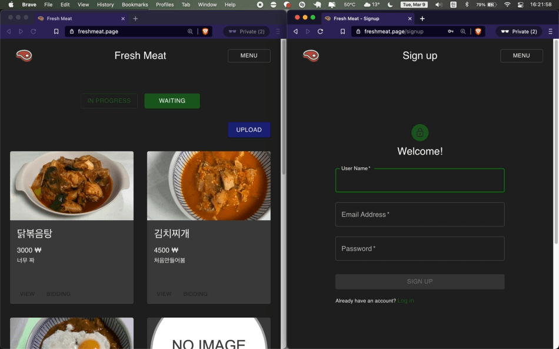
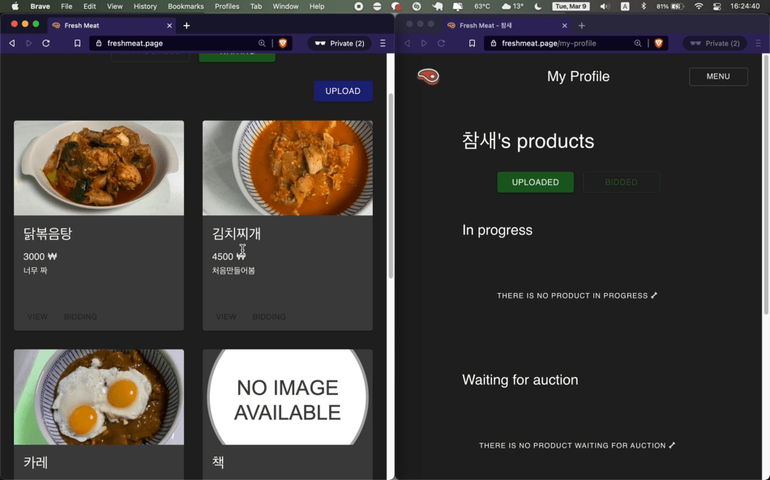
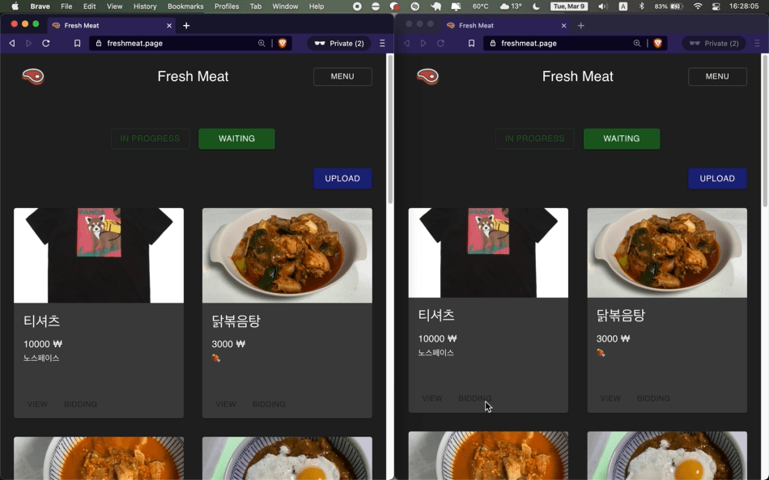
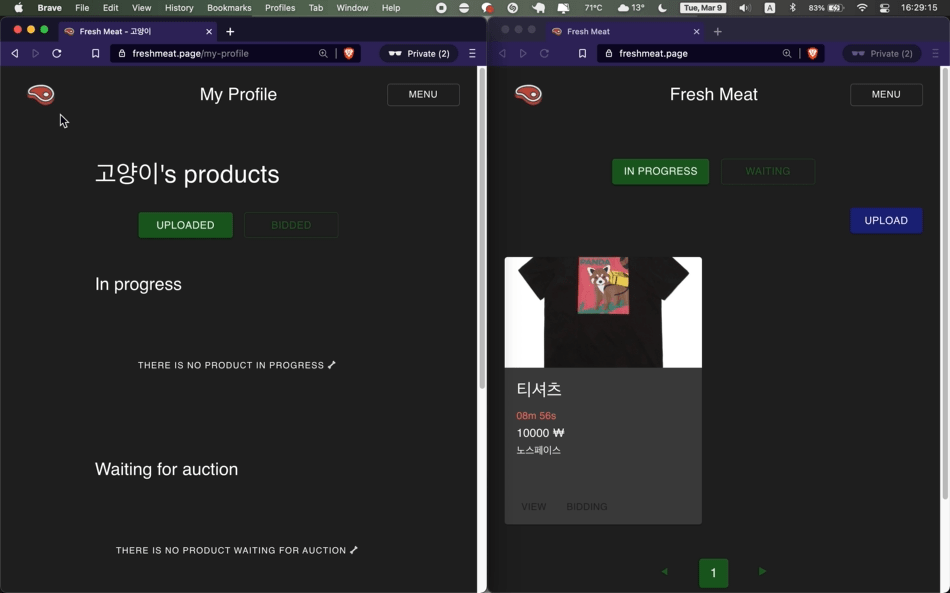
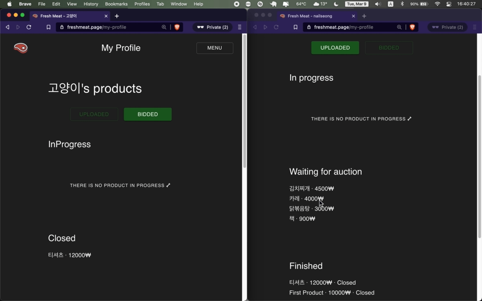
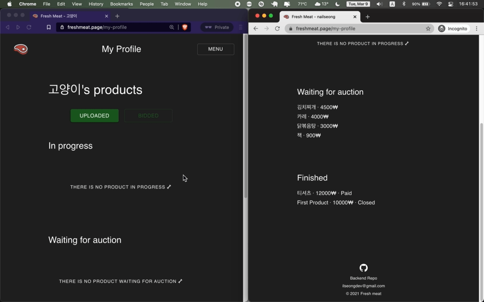
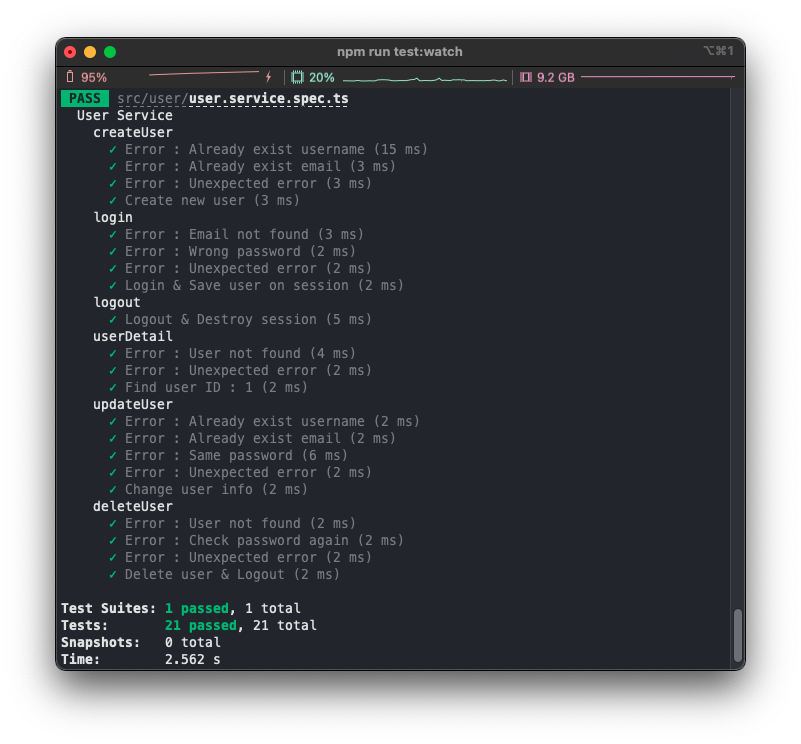
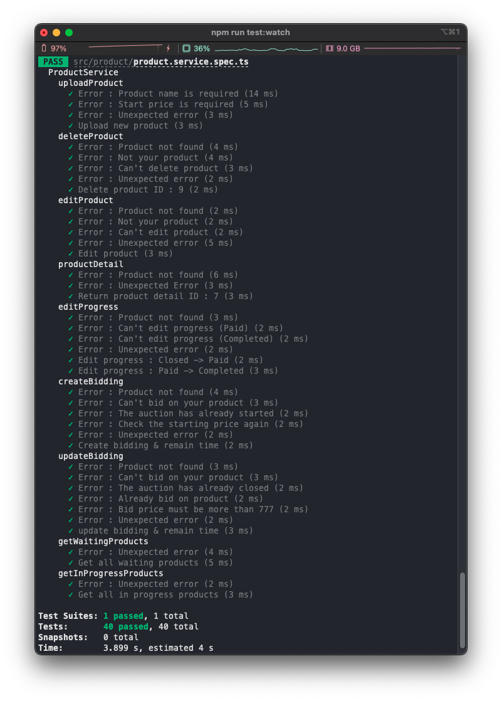
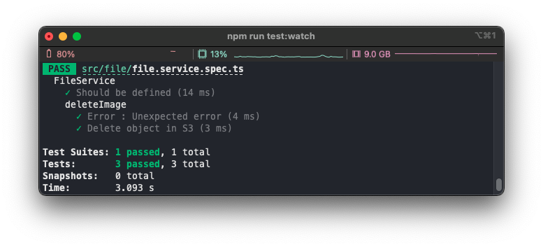
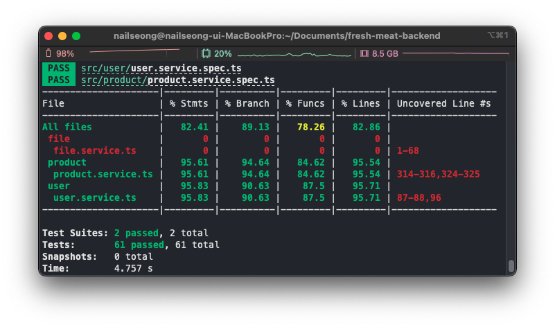

# Fresh meat

팔고 싶은 상품을 경매로 사고팔 수 있도록 중개해 주는 서비스
**https://freshmeat.page/**

---

## Table of Contents

- [General Info](#general-Info)
  - [Stack](#stack)
  - [Preview](#preview)
- [Schema](#schema)
  - [User](#user)
  - [Product](#product)
  - [File](#file)
- [Unit Test](#unit-test)
  - [User Service](#user-service)
  - [Product Service](#product-service)
  - [File Service](#file-service)
  - [Coverage](#coverage)
- [API](#api)
  - [Query](#query)
  - [Mutation](#mutation)
- [Memo](#memo)

---

## General Info

### Stack

프레임워크로 <a href="https://nestjs.com/" target="_blank">NestJS</a>를 사용해서 <a href="https://graphql.org/" target="_blank">GraphQL</a> API를 구현했습니다. 데이터베이스로 <a href="https://www.postgresql.org/" target="_blank">PostgreSQL</a>을 사용하고 ORM은 <a href="https://typeorm.io/#/" target="_blank">TypeORM</a>을 사용했습니다. Session Storage로 사용하는 <a href="https://redis.io/" target="_blank">Redis</a>에 로그인한 사용자의 정보를 저장합니다.

### Preview

> 직접 확인해 볼 수 있습니다! 😁 &rarr; **https://freshmeat.page/**
> Frontend repo &rarr; **https://github.com/naIlSeong/fresh-meat-frontend**

- **회원가입 & 로그인**
  

</br>

- **상품 수정**
  

</br>

- **상품 업로드**
  

</br>

- **입찰**
  

</br>

- **상회 입찰**
  

</br>

- **지불 확인 요청**
  

</br>

- **지불 확인**
  

</br>

---

## Schema

하나의 `User`는 여러 개의 `sellingProducts`와 `1:N` 관계이고, `biddingProducts`와도 마찬가지로 `1:N` 관계입니다. `Product` 경매(거래) 진행 상태를 나타내는 `Progress`는 `Waiting`, `InProgress`, `Closed`, `Paid`, 그리고 `Completed` 중 하나입니다. 또한 `Product`는 하나의 이미지로써 `File`와 1:1 관계입니다.

### User

```User Entity
type User {
  id: Float!

  createdAt: DateTime!

  updatedAt: DateTime!

  username: String!

  email: String!

  password: String!

  // OneToMany
  sellingProducts: [Product!]

  // OneToMany
  biddingProducts: [Product!]
}

```

### Product

```Product Entity
type ProductObjectType {
  id: Float!

  createdAt: DateTime!

  updatedAt: DateTime!

  productName: String!

  description: String

  // OneToOne
  picture: File

  // ManyToOne
  seller: User!

  // ManyToOne
  bidder: User

  startPrice: Float!

  bidPrice: Float

  remainingTime: DateTime

  progress: Progress!
}
```

### File

```File Entity
type FileObjectType {
  id: Float!

  createdAt: DateTime!

  updatedAt: DateTime!

  // OneToOne
  product: Product!

  url: String!

  key: String!

  fileName: String!
}
```

---

## Unit Test

유닛 테스트를 위해 자바스크립트 테스팅 프레임워크인 <a href="https://jestjs.io/" target="_blank">Jest</a>를 사용했습니다.

### User Service



### Product Service



### File Service



### Coverage



---

## API

> _Note_: 별도로 `Public`을 명시하지 않은 API는 `login`한 유저만 요청할 수 있습니다.
> 요청이 실패하면 `"ok": false`이고 `error`메세지를 반환합니다. 만약 요청이 성공하면 `"ok": true`이고 `"error": null`입니다. 또한 예기치 못한 `error`는 모두 `"error": "Unexpected error"`를 반환합니다.

### Query

**me**

- Notes:

현재 로그인되어있는 유저의 정보를 요청

- Query

```me query
query {
  me {
    username
    email
    sellingProducts {
      productName
      progress
    }
    biddingProducts {
      productName
      progress
    }
  }
}
```

- Variables

_no variables_

- Error Response:

</br>

**userDetail**

- Notes:

_Public Query_
유저 한명의 정보와 `progress`가 `Waiting`이거나 `InProgress`인 그 유저가 업로드한 `Product`를 요청

- Query

```userDetail
query userDetail ($input: UserDetailDto!) {
  userDetail(input: $input) {
    ok
    error
    user {
      email
      username
    }
    inProgress {
      productName
    }
    waiting {
      productName
      startPrice
      progress
    }
  }
}
```

- Variables

```userDetail_varialbles
{
  "input": {
    "userId": 1
  }
}
```

- Error Response:
  - `User not found`: `userId`가 일치하는 `User`를 찾지 못함

</br>

**myProfile**

- Notes:

`progress`가 `Paid`이거나 `Closed`이거나 `Completed`인 유저가 업로드한 `uploadedProduct`와 유저가 `bidding`한 `Product`를 요청

- Query

```myProfile
query {
  myProfile {
    ok
    error
    uploadedProduct {
      id
      productName
    }
    inProgressProduct {
      id
      productName
    }
    closedProduct {
      id
      productName
    }
    paidProduct {
      id
      productName
    }
    completedProduct {
      id
      productName
    }
  }
}
```

- Variables

_no variables_

- Error Response:

</br>

**productDetail**

- Notes:

_Public Query_
`Product`의 정보와 `seller`, `bidder`의 정보를 요청

- Query

```productDetail
query productDetail ($input: ProductDetailDto!) {
  productDetail (input: $input) {
    ok
    error
    product {
      id
      productName
      startPrice
      picture {
        url
      }
      seller {
        username
      }
      bidder {
        username
      }
    }
  }
}
```

- Variables

```productDetail_variables
{
  "input": {
    "productId": 1
  }
}
```

- Error Response:
  - `Product not found`: `productId`가 일치하는 `Product`를 찾지 못함

</br>

**getWaitingProducts**

- Notes:

_Public Query_
`progress`가 `Waiting`인 모든 `Product`를 요청

- Query

```getWaitingProducts
query getWaitingProducts ($input: GetAllProductsDto!) {
  getWaitingProducts (input: $input) {
    ok
    error
    maxPage
    products {
      id
      productName
      picture {
        url
      }
    }
  }
}
```

- Variables

```getWaitingProducts_variables
{
  "input": {
    "page": 1
  }
}
```

- Error Response:

</br>

**getInProgressProducts**

- Notes:

_Public Query_
`progress`가 `InProgress`인 모든 `Product`를 요청

- Query

```getInProgressProducts
query getInProgressProducts ($input: GetAllProductsDto!) {
  getInProgressProducts (input: $input) {
    ok
    error
    maxPage
    products {
      id
      productName
      picture {
        url
      }
    }
  }
}
```

- Variables

```getInProgressProducts_variables
{
  "input": {
    "page": 1
  }
}
```

- Error Response:

</br>

### Mutation

**createUser**

- Notes:

_Public Mutation_
새로운 `User`를 생성

- Query

```createUser
mutation createUser ($input: CreateUserDto!) {
    createUser (input: $input) {
        ok
        error
    }
}
```

- Variables

```createUser_variables
{
  "input": {
    "username": "test",
    "email": "test@mail.com",
    "password": "1q2w3e4r"
  }
}

```

- Error Response:
  - `Already exist username`: 이미 `username`이 동일한 `User`가 존재
  - `Already exist email`: 이미 `email`이 동일한 `User`가 존재

</br>

**login**

- Notes:

_Public Mutation_
`Session Storage`에 `Login`한 `User`의 정보를 저장

- Query

```login
mutation login ($input: LoginDto!) {
    login (input: $input) {
        ok
        error
    }
}
```

- Variables

```login_variables
{
  "input": {
    "email": "test@mail.com",
    "password": "1q2w3e4r"
  }
}
```

- Error Response:
  - `Email not found`: `email`이 일치하는 `User`가 없음
  - `Wrong password`: `email`이 일치하는 `User`의 `password`와 일치하지않는 `password`

</br>

**logout**

- Notes:

_Public Mutation_
`Session Storage`에 저장된 `User`의 정보를 삭제

- Query

```logout
mutation logout {
    logout {
        ok
        error
    }
}
```

- Variables

_no variables_

- Error Response:

  - `Error: Destroy session`: `Session Storage`에 저장된 `User`의 정보를 삭제하는 과정에서 예기치 못한 에러가 발생

</br>

**updateUser**

- Notes:

`User`의 정보를 `update`

- Query

```updateUser
mutation updateUser ($input: UpdateUserDto!) {
    updateUser (input: $input) {
        ok
        error
    }
}
```

- Variables

```updateUser_variables
{
  "input": {
    "username": "newUserName",
    "email": "new@mail.com",
    "password": "q1w2e3r4"
  }
}
```

- Error Response:
  - `Already exist username`: 변경하고자 하는 `username`이 이미 사용 중
  - `Already exist email`: 변경하고자 하는 `email`이 이미 사용 중
  - `Same password`: 현재의 `password`와 변경하고자 하는 `password`가 동일할 때

</br>

**deleteUser**

- Notes:

`User`의 정보를 `Database`와 `Session Storage`에서 삭제

- Query

```deleteUser
mutation deleteUser ($input: DeleteUserDto!) {
    deleteUser (input: $input) {
        ok
        error
    }
}
```

- Variables

```deleteUser_variables
{
  "input": {
    "password": "1q2w3e4r"
  }
}
```

- Error Response:
  - `Check password again`: `password`가 일치하지 않음

</br>

**uploadProduct**

- Notes:

새로운 `Product`를 `upload`

- Query

```uploadProduct
mutation uploadProduct ($input: UploadProductDto!) {
    uploadProduct (input: $input) {
        ok
        error
        productId
    }
}
```

- Variables

```uploadProduct_variables
{
  "input": {
    "productName": "IPhone 12",
    "description": "Blue color",
    "startPrice": 1000
  }
}
```

- Error Response:
  - `Product name is required`: `productName`이 존재하지 않음
  - `Start price is required`: `startPrice`가 존재하지 않음

</br>

**deleteProduct**

- Notes:

`Product`를 삭제하고 `File`이 있으면 `deleteImage`를 호출해서 `S3`에서 객체를 삭제

- Query

```deleteProduct
mutation deleteProduct ($input: DeleteProductDto!) {
    deleteProduct (input: $input) {
        ok
        error
    }
}
```

- Variables

```deleteProduct_variables
{
  "input": {
    "productId": 1
  }
}
```

- Error Response:
  - `Product not found`: `productId`가 일치하는 `Product`를 찾을 수 없음
  - `Not your product`: `Product`의 `seller`가 현재 로그인한 `User`가 아님
  - `Can't delete product`: `progress`가 `Waiting`이거나 `Completed`가 아님

</br>

**editProduct**

- Notes:

`Product`의 정보를 `update`하고 `deleteImage`가 `true`이면 `deleteImage`를 호출

- Query

```editProduct
mutation editProduct ($input: EditProductDto!) {
    editProduct (input: $input) {
        ok
        error
    }
}
```

- Variables

```editProduct_variables
{
  "input": {
    "productName": "",
    "description": "",
    "startPrice": "",
    "productId": 1,
    "deleteImage": true
  }
}
```

- Error Response:
  - `Product not found`: `productId`가 일치하는 `Product`를 찾을 수 없음
  - `Not your product`: `Product`의 `seller`가 현재 로그인한 `User`가 아님
  - `Can't edit product`: `progress`가 `Waiting`이 아님

</br>

**editProgress**

- Notes:

`Product`의 `progress`를 다음 단계로 `update`

- Query

```editProgress
mutation editProgress ($input: EditProgressDto!) {
    editProgress (input: $input) {
        ok
        error
    }
}
```

- Variables

```editProgress_variables
{
  "input": {
    "productId": 1
  }
}
```

- Error Response:
  - `Product not found`: `productId`가 일치하는 `Product`를 찾을 수 없음
  - `Can't edit progress`: 권한 없음 _e.g `Closed` -> `Paid`일 때 `User`가 `bidder`가 아닐 때_

</br>

**createBidding**

- Notes:

`Product`의 `progress`가 `Waiting`일 때 `startPrice`로 입찰을 하고 `remainingTime`을 현재 시각에서 10분 후로 `update`

- Query

```createBidding
mutation createBidding ($input: CreateBiddingDto!) {
    createBidding (input: $input) {
        ok
        error
    }
}

```

- Variables

```createBidding_variables
{
  "input": {
    "productId": 1,
    "startPrice": 1000
  }
}
```

- Error Response:
  - `Product not found`: `productId`와 일치하는 `Product`를 찾을 수 없음
  - `Can't bid on your product`: 로그인 한 `User`가 `Product`의 `seller`임
  - `The auction has already started`: `progress`가 `Waiting`이 아님
  - `Check the starting price again`: `startPrice`가 일치하지 않음

</br>

**updateBidding**

- Notes:

`Product`의 `progress`가 `InProgress`일 때 `bidPrice`보다 큰 금액으로 상위 입찰을 하고 `remainingTime`을 현재 시각에서 10분 후로 다시 `update`

- Query

```updateBidding
mutation updateBidding ($input: UpdateBiddingDto!) {
    updateBidding (input: $input) {
        ok
        error
    }
}

```

- Variables

```updateBidding_variables
{
  "input": {
    "productId": 1,
    "bidPrice": 1500
  }
}
```

- Error Response:
  - `Product not found`: `productId`와 일치하는 `Product`를 찾을 수 없음
  - `Can't bid on your product`: 로그인 한 `User`가 `Product`의 `seller`임
  - `The auction has already started`: `progress`가 `InProgress`가 아님
  - `Already bid on product`: 이미 `Product`에 입찰했고 `bidder`가 로그인한 `User`임
  - `Bid price must be more than bidPrice`: 입찰하려는 금액이 `bidPrice`보다 작거나 같음

</br>

**uploadImage**

- Notes:

`S3`에 객체를 업로드하고 객체의 정보를 `File`에 저장

- Query

```uploadImage
mutation uploadImage ($productId: Float!, $file: Upload!) {
    uploadImage (productId: $productId, file: $file) {
        ok
        error
    }
}

```

- Variables

```uploadImage_variables
{
  "productId": 1,
  "file": // Image File
}
```

- Error Response:

</br>

---

## Memo

#### **Issue #1**

Set-cookie not working when executing login mutation in playground

**Solution**
In playground "request.credentials": `"omit"` &rarr; `"same-origin"`

---

#### **Issue #2**

In updateUser the hashed password is hashed again during `updateUser`

**Solution**
Update `user.entity.ts`

```
...
  @Column({ select: false })
  @Field((type) => String)
  @IsString()
  @Length(8)
  password: string;

```

---

#### **Issue #3**

Can't read session type during unit test

**Solution**
Update `SessionData` of `express-session` in `common.interface.ts` and delete `ISession`

```
...
declare module 'express-session' {
  interface SessionData extends session.Session {
    user?: User;
  }
}
```

---

#### **Issue #4**

Cookie is set in the frontend but cannot be read

**Solution**

Update `express-session` setting in `main.ts` like:

```
  app.use(
    session({
      ...
      cookie: {
        ...
        domain:
          process.env.NODE_ENV === 'production' ? process.env.DOMAIN : null,
      },
    }),
  );
```

docs: https://developer.mozilla.org/ko/docs/Web/HTTP/Headers/Set-Cookie
