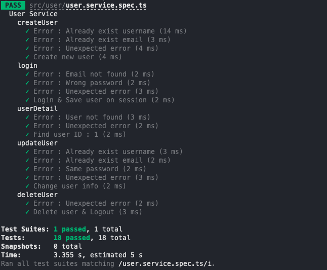
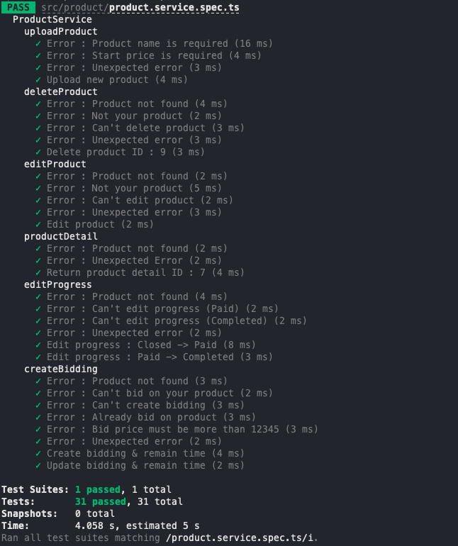
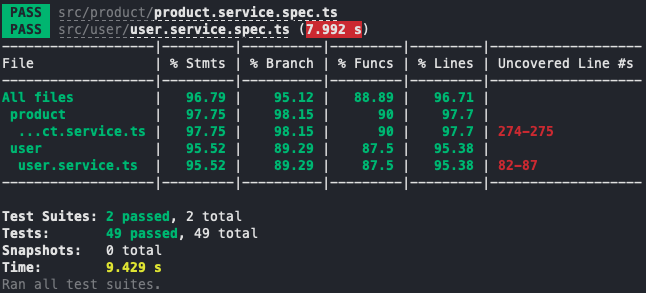
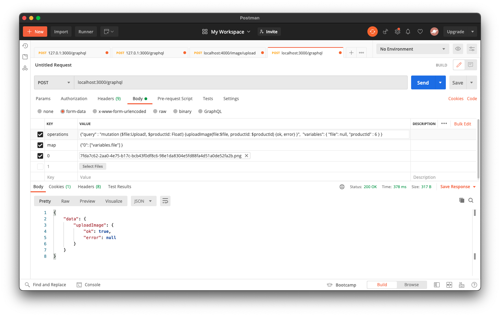

# Fresh Meat

---

## Table of contents

- [General info](#general-info)
- [Structure](#structure)
- [Todo](#todo)
- [Test](#test)
- [Memo](#memo)

---

## General info

<a href="https://nestjs.com/" target="_blank">NestJS</a>, <a href="https://graphql.org/" target="_blank">GraphQL</a>, <a href="https://typeorm.io/#/" target="_blank">TypeORM</a>, <a href="https://www.postgresql.org/" target="_blank">PostgreSQL</a> and <a href="https://redis.io/" target="_blank">Redis</a>

---

## Structure

- **User**

  - Email or Phone number
  - Password
    <br>

- **Product**
  - Seller
  - Bidder
  - Start price
  - Bid price
  - Remaining time
  - Progress (enum)

---

## Todo

- [ ] How many people participated in the auction

- **User Module**

  - [x] Create User
  - [x] Login
  - [x] User Detail
  - [x] Update User
  - [x] Delete User
        <br>

- **Product Module**
  - [x] Upload Product
  - [x] Delete Product
  - [x] Edit Product
  - [x] Bid on Product
    - [x] Create Bidding
    - [x] Update Bidding
    - [x] Finish Bidding
  - [x] Product Detail
  - [x] Edit Progress
    - Waiting
    - InProgress
    - Closed (Waiting for payment)
    - Paid (Waiting for confirmation)
    - Completed
  - [x] Get Waiting Products
  - [x] Get InProgress Products

---

## Test

**To run test this project:**

```
// Unit Test

$ npm run test
```

</br>
<div style="text-align:center">
  
</div>
<div style="text-align:center">
  <span style="font-weight:bold">
    User Service
  </span>
</div>
</br>
  
</br>
<div style="text-align:center">
  
</div>
<div style="text-align:center">
  <span style="font-weight:bold">
    Product Service
  </span>
</div>
</br>

```
// Unit Test Coverage

$ npm run test:cov
```

</br>
<div style="text-align:center">
  
</div>
<div style="text-align:center">
  <span style="font-weight:bold">
    Unit Test Coverage
  </span>
</div>

---

</br>
<div style="text-align:center">
  
</div>
<div style="text-align:center">
  <span style="font-weight:bold">
    uploadImage test using postman
  </span>
</div>

---

## Memo

#### **Issue #1**

Set-cookie not working when executing login mutation in playground

**Solution**
In playground "request.credentials": `"omit"` &rarr; `"same-origin"`
